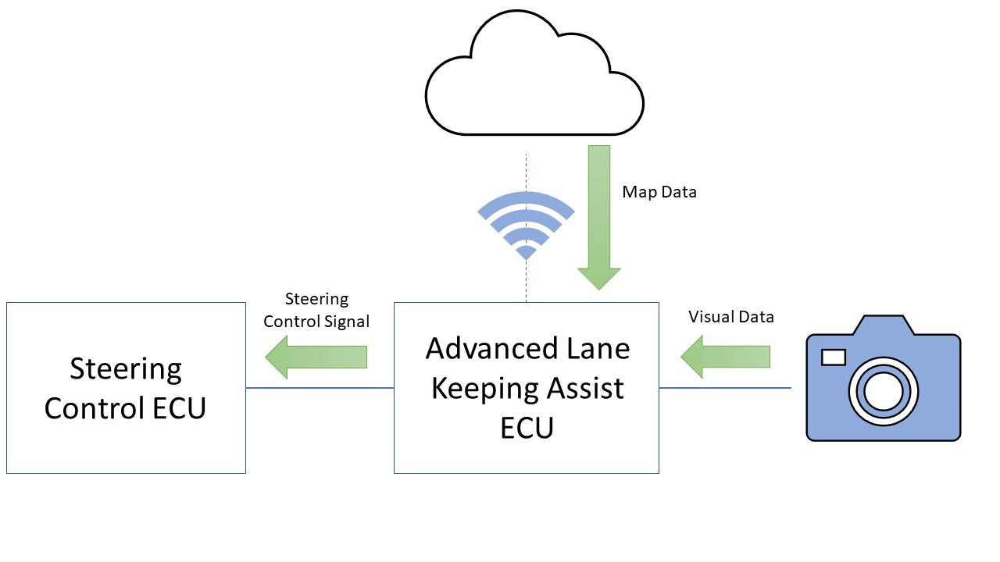

# Advanced Lane Keeping Assist

## Description
This project is for my Advanced Driver Assistance Systems assignment. The requirements of this assignment are to design, implement and simulate an ADAS solution using Matlab and Simulink.

The feature of an autonomous car that I have chosen to design in this project is Advanced Lane Keeping Assist. This feature will be used on roads without road markings to help with positioning of the vehicle on the road by calculating where the road markings should be, thereby creating a lane in which the car should remain. 

## Design
This feature takes data from external sensors such as cameras to analyse the road ahead. This data is combined with data from the cloud which indicates the type of road that the car is on, for example if the car is on a one-way road it does not need to calculate the position of two lanes as there will be no on-coming cars. In the event that the car moves onto a road where there is road markings visible, this system will turn off and another lane keeping assist algorithm can take over.

*Figure 1: Design Diagram*

## Implementation
This project was implemented using Matlab and Simulink. The main algorithm used in the Matlab section of the project was the Hough transform.

A plant model of a car was used in Simulink to simulate the communication between the Matlab algorithm and the steering control.

This feature detects the edge of the road and measures the distance between each edge. This distance is then divided by 2 and a line is drawn along the center-line of the road creating two lanes. Map data is used to make a decision on which lane the car should drive in as well as confirming the type of road, i.e. a one-way road. Messages are then sent to the steering ECU to keep the car within the calculated lane.

## Assumptions
The car is driving on a well-lit road

## Benchmarks
* The system must be able to detect that a road has no road markings using the visual data from the cameras

* The system must be able to identify the edge of the road

* The system must be able to measure the width of the road and divide is accordingly

* The system must indicate to the driver where the road markings should be.

## Possibility for further development
In a future development of this feature, the system could take the width of the vehicle into account when choosing the positioning within the lane.

The system could also detect oncoming vehicles on a narrow road and determine which vehicle should have right of way based on whether there is enough room for both vehicles to pass or based on which vehicle has room to pull in and allow for the other to pass. This would require Vehicle-to-Vehicle communication (V2V).